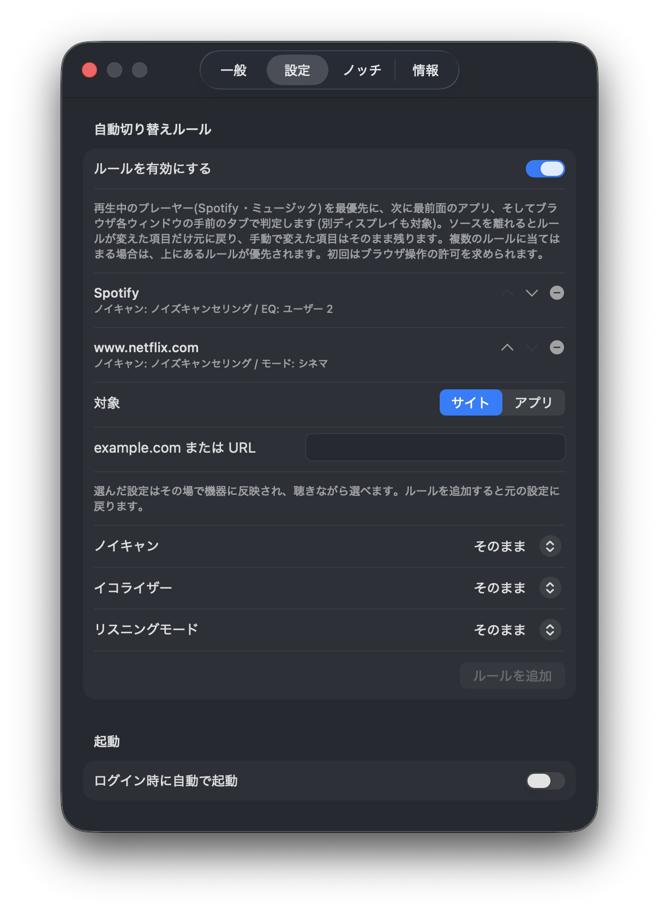

# Perch

**MacBook のノッチが、Sony ヘッドホン・イヤホンのリモコンになります。**

Perch(パーチ)は、ノッチに小さく住みつく常駐アプリです。ヘッドホンを接続すると、ノッチの左右に機種名とバッテリー残量がそっと現れます。ノッチをクリックすると操作パネルが広がり、ノイズキャンセリングもイコライザーも、公式アプリを開かずにその場で切り替えられます。


有志による非公式ツールです(Sony とは無関係です)。

## できること

- **バッテリー残量がいつでも見える** — ノッチの右側に L/R(とケース)の残量を表示
- **ノイズコントロール** — ノイズキャンセリング / 外音取り込み / オフをワンクリックで。外音レベルの調整も
- **イコライザー** — プリセットの切り替えと、バンドをドラッグしての微調整
- **リスニングモード** — 標準 / BGM / シネマ(対応機種のみ)
- **スピーク・トゥ・チャット** — オンオフ、感度、終了時間。通話中に自分の声を聞く設定も
- **再生中の曲を表示・操作** — パネル左側にジャケットと再生ボタン
- **自動切り替えルール** — 「Netflix を見たらシネマモード」「Spotify ではこの EQ」のように、見ているサイトや使っているアプリに合わせて自動で切り替え。離れたら元の設定に戻ります
- **表示スタイルが選べる** — バーを常に表示 / ホバーした時だけ表示。動画を全画面にするとノッチごと隠れます
- **日本語 / English** 対応、ログイン時の自動起動対応

対応する機能は接続した機器が自分で申告してくるものだけを表示します。未対応の機能のページはそもそも現れません。

自動切り替えルールは設定画面から登録します。接続中は選んだ設定がその場で機器に反映されるので、聴き比べながら決められます:



(動画版のデモは [docs/media/notch-panel-demo.mp4](docs/media/notch-panel-demo.mp4) にもあります)

## 対応機器

WF-1000XM6 / WH-1000XM6 で動作確認済みです。それ以外の機種でも、機器が申告する機能に応じて動くように設計されています。未確認の機種は注意表示つきで動作し、設定画面の「解析レポートを用意」から対応申請を送ることができます(Bluetooth アドレスなどの個人情報は含まれません)。

## インストール

現時点ではソースからのビルドが必要です(macOS 14 以降)。

```sh
git clone https://github.com/remon-nomer66/perch.git
cd perch
tools/package_app.sh
open .build/Perch.app
```

初回起動時に **Bluetooth** の許可を求められます(機器の状態の読み取りと設定変更に使います)。再生表示や自動ルールを使うと、対象アプリ・ブラウザへの**オートメーション**許可も求められます。使わなければ要求されません。

## 困ったときは

- **ノッチにバーが出ない** — ヘッドホンが Mac の音声出力先になっているか確認してください。メニューバーの魚のアイコンからも設定を開けます
- **「別の端末が操作しています」** — スマホの公式アプリなどが接続を握っています。相手を閉じてから「再接続」を押してください
- **ビルドし直すたびに権限を聞かれる** — 署名が毎回変わるためです。下の開発者向けの `PERCH_SIGN_IDENTITY` を設定してください

## プライバシー

- 利用状況の収集や、独自サーバーへの送信は一切行いません。
- 再生中の曲のジャケットだけは、プレーヤーが提供する URL(外部 CDN)から直接取得します。パネル表示中はこの配信元への通信が発生し、IP アドレスなどの接続情報が配信元へ渡ります。曲名などのメタデータを外部へ送ることはありません。
- アクセシビリティ、入力監視、画面収録の権限は要求しません。

---

# 開発者向け

## 要件

- macOS 14 以降、Xcode Command Line Tools または Xcode
- Mac と対象機器の Classic Bluetooth ペアリング

## ビルドとテスト

```sh
swift test
swift build
```

### .app の生成

ログイン時起動(`SMAppService`)と権限(TCC)の付与はアプリバンドルと署名に紐づくため、常用には `.app` を生成する。

```sh
tools/package_app.sh            # debugビルド(既定)
tools/package_app.sh release    # releaseビルド(アプリアイコン必須)
```

生成先は `.build/Perch.app`。挙動は環境変数で調整できる。

| 環境変数 | 内容 |
| --- | --- |
| `PERCH_SIGN_IDENTITY` | codesignのidentity。未指定はad-hoc署名となり、ビルドのたびに権限の再許可が必要になる。常用するならKeychain Accessで一度だけ自己署名証明書を作って指定する |
| `PERCH_VERSION` / `PERCH_BUILD` | `CFBundleShortVersionString` / `CFBundleVersion` の上書き。未指定のreleaseビルドは `git describe` とコミット数から補う |
| `PERCH_NOTARY_PROFILE` | `notarytool store-credentials` のプロファイル名。Developer ID署名のreleaseビルドで指定すると公証とstapleまで行う。未指定なら自己署名のまま |

## 権限

| 権限 | 用途 |
| --- | --- |
| Bluetooth | 機器の状態の読み取りと設定の変更 |
| Apple Events | 再生表示・再生操作(音楽アプリ)と、自動ルールのサイト判定(ブラウザ)。使わなければ要求されない |

## 設計上の制約

- 機能の有無・バンド数・プリセット・モードはすべて機器の申告(capability)から読む。機種依存の値は焼き付けない
- 制御セッションは同時に1クライアントしか保持できない。本アプリはMacが音声出力先である間だけ保持し、外れたら解放する
- 再生情報はScriptingBridge経由で取得する。システム全体の再生情報を読む非公開APIは、自前ビルドのアプリからは利用できないため使わない

設計の全体は [docs/implementation-plan.md](docs/implementation-plan.md) を参照。

## ライセンス

本ソフトウェアは **GNU Affero General Public License v3.0 (AGPL-3.0)** で提供する。Copyright (C) 2026 remon-nomer66。全文は [LICENSE](LICENSE)。

- 自由に利用・改変・再配布できる。ただし**改変版を配布、またはネットワーク越しに提供する場合は、全ソースコードを同じ AGPL-3.0 で公開する義務**がある。
- `soundconnectd` 由来のファイルは **MIT** のまま含む(帰属を維持)。第三者著作物の表示は [THIRD_PARTY_NOTICES.md](THIRD_PARTY_NOTICES.md) を参照。

### 商標・ブランド

アプリ名「**Perch**」およびアプリアイコンは本プロジェクトの識別標識であり、**ライセンス(AGPL-3.0)の対象外**として権利者が留保する。フォークや再配布の際に、本プロジェクトと混同させる形で「Perch」の名称・アイコンを使うことはできない。**派生物は別の名称・別のアイコンで配布すること。** 詳細は [TRADEMARK.md](TRADEMARK.md)。

### 非公式

本ソフトウェアは有志による非公式ツールであり、Sony Group Corporationおよびその関連会社とは一切関係がなく、同社の承認も受けていない。
"Sony"、"WH-1000XM"、"WF-1000XM"、"LinkBuds" その他の名称はそれぞれの権利者の商標であり、対応機器を説明する目的でのみ用いる。
